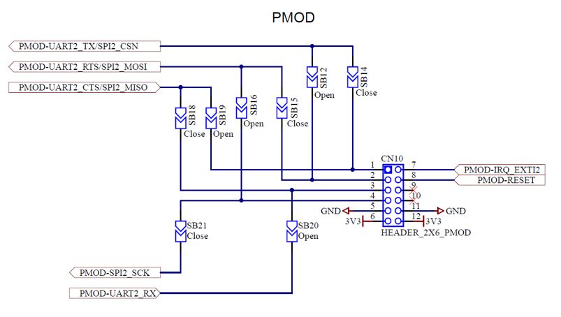
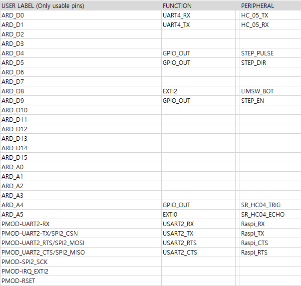

# STM32 Firmware
ST B-L4S5I-IOT01A 보드 펌웨어. 

## Environments
---
- ST B-L4S5I-IOT01A
- STM32CubeIDE v1.5.0
- [STM32Cube.AI][x-cube-ai-ref] v5.2.0
사용된 Tensorflow Lite model은 ai 디렉토리에 있으며, tensorflow 2.4.0 버젼에서 생성됨.

## Requirements
---
### Setting the STM board
Raspberry pi로부터 2Mbps의 속도로 UART 통신을 통해 이미지 데이터를 받아옴. 안정적인 통신을 위해 RTS/CTS를 통한 하드웨어 흐름제어가 필수적. RTS/CTS 흐름제어가 가능한 UART2 사용을 위해 B-L4S5I-IOT01A 보드 뒷면의 점퍼 전극을 다음과 같이 연결해야함.

SB12,16,19,20 - Close (납땜으로 연결)  
SB14,15,18,21 - Open (기존의 연결 제거)

### Connections to peripherals

***SR-HC04***
SR_HC04_TRIG : Trigger pin  
SR_HC04_ECHO : Echo pin

***MW-VSTB24D1S-v2***
STEP_PULSE : CLK+  
STEP_DIR : DIR+  
STEP_EN : ENA+  

***HC-05***
HC_05_TX : TX  
HC_05_RX : RX

baud 9600bps

***Raspberry Pi 4***
[Reference][rpi-rts-cts] 
Raspi_RX : pin 10  
Raspi_TX : pin 8  
Raspi_CTS : pin 36  
Raspi-RTS : pin 11  

## How to start
---
1) Raspberry Pi에서 serial.py 실행
2) STM32펌웨어 업로드 및 실행
3) 라즈베리파이 카메라에 얼굴을 비치고 SR-HC04로 사람이 감지되면 얼굴 촬영 후 나이 인식 및 키오스크 높이 조절

   [x-cube-ai-ref]: <https://www.st.com/resource/en/user_manual/dm00570145-getting-started-with-xcubeai-expansion-package-for-artificial-intelligence-ai-stmicroelectronics.pdf>
   [rpi-rts-cts]: <https://ethertubes.com/wp-content/uploads/uart_raspberry_pi_3_pinout.png>
